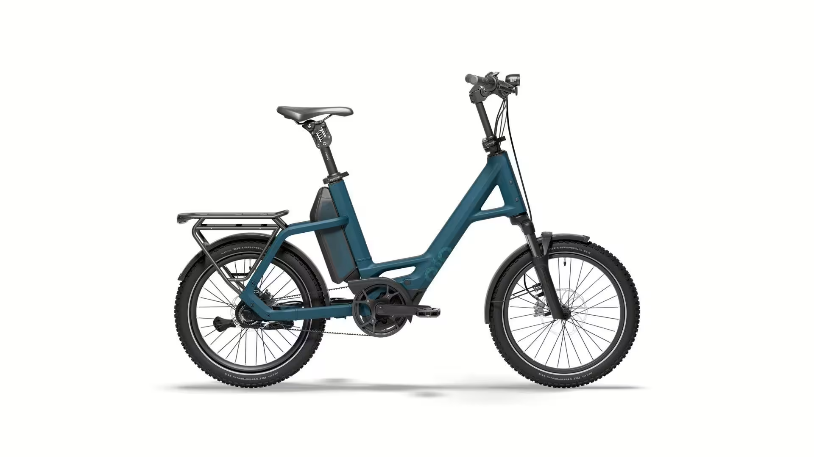

# Přehled modelu CX5x

<!-- HLAVNÍ OBRÁZEK MODELU -->

 

Podvozek se setkává s funkcí – "Compact CX5x" od QiO kombinuje výhody kompaktního elektrokola s pohodlím vidlice s odpružením. S délkou zdvihu 80 mm kompenzuje nerovnosti a poskytuje znatelně větší komfort při jízdě – zejména na dlažebních kostkách, lesních cestách nebo špatných cyklostezkách. To dělá každou cestu pohodlnější, ať už jdete kamkoli.
Díky vysoké kapacitě baterie až 800 Wh mohou vaše prohlídky trvat i večerních hodin. Bosch středový motor se Smart System vás vždy podporuje výkonně až do 25 km/h, zatímco nenáročný řemen a pětistupňová převodovka Shimano "Nexus" zajišťují plynulou a spolehlivou jízdu. Hydraulické čtyřpístkové kotoučové brzdy od Magury vás bezpečně zastaví – za každého počasí.
Maximální bezpečnost a kontrolu zajišťují hydraulické kotoučové brzdy se čtyřmi pístky, které spolehlivě zpomalují i za mokra a při vysokých rychlostech. Osvětlení zajišťuje vysoce kvalitní LED světlomet Busch+Müller IQ-XS Beam, který nabízí vynikající osvětlení silnice s funkcí 100 luxů a 150 luxů dálkových světel – ideální pro jízdu ve tmě a za špatné viditelnosti..

## <u><strong>Rychlé informace</strong></u>

- Typ rámu: QIO Compact, Bosch Gen. 4, BES3, hliník, 48 cm 
- Velikosti: Unisex, 20"
- Barvy: Lead metal glossy; Lunar white matt; Night black matt; Dark olive matt; Petrol blue matt; Imola red glossy; Retro blue matt 
- Hlavní komponenty: **Vidlice**: SR SUNTOUR "SF22-Mobie34-CGO-Boost", zdvih 80 mm; **Motor**: BOSCH Drive Unit Performance CX/ 100Nm; **Baterie**:PowerPack 800; **Brzdy**:MAGURA "LOUISE" hydraulické kotoučové; **Řazení**:SHIMANO "Nexus SG-C7000-5D", 5stupňová převodovka, středový zámek
- Zaměření modelu: Kompaktní městské elektrokolo 

## <u><strong>Odkazy na další části</strong></u>

👉 [Montáž](Montáž.md)  
👉 [Kusovníky](Kusovníky.md)