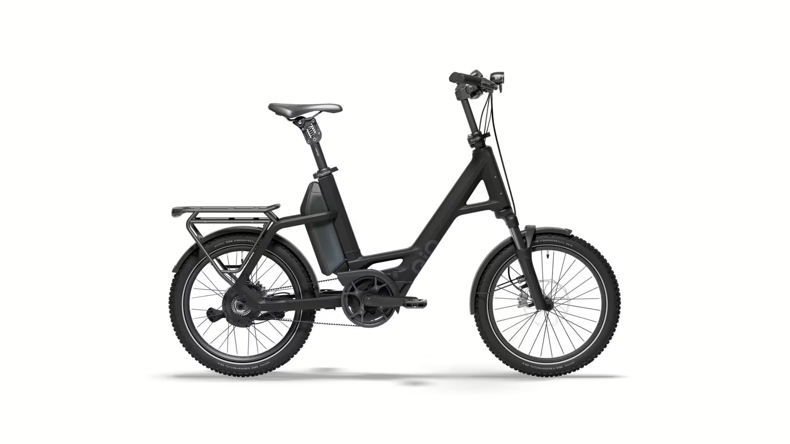

# Přehled modelu CXNINEx

<!-- HLAVNÍ OBRÁZEK MODELU -->

"Compact CXNINEx" od QiO je nejlepší model v sérii a redefinuje moderní mobilitu elektrokol – s nekompromisním důrazem na výkon, pohodlí a efektivitu. Motocykl je vybaven výkonným středovým motorem Bosch Performance Line CX a systémem Smart a nabízí dynamickou a jemně modulovanou podporu až do 25 km/h, což je ideální pro městské i venkovské trasy.
Vidlice s rozchodem 80 mm a sedlovka zajišťují znatelné snížení vibrací a nárazů – i na nerovných površích. Podvozek doplňuje vysoce kvalitní náboj 3x3, který poskytuje devět přesně laděných převodů pro maximální efektivitu a komfort jízdy.
Řemenový pohon Gates CDX znamená nízkou údržbovou odolnost a obzvlášť hladkou jízdu. V kombinaci s výkonnou baterií 800 Wh je výsledkem působivý dojezd, který snadno zvládne i delší trasy.
Maximální bezpečnost a kontrolu zajišťují hydraulické kotoučové brzdy se čtyřmi pístky, které spolehlivě zpomalují i za mokra a při vysokých rychlostech. Osvětlení zajišťuje vysoce kvalitní dálkový světlomet Busch+Müller "IQ-XS" mED, který nabízí vynikající osvětlení silnice s funkcí 100 luxů a 150 luxů dálkových světel – ideální pro jízdu ve tmě a za špatné viditelnosti.

## <u><strong>Rychlé informace</strong></u>

- Typ rámu: QIO Compact, Bosch Gen. 4, BES3, hliník, 48 cm 
- Velikosti: One‑Size (doporučeno 150–190 cm) -> 20"
- Barvy: Lead metal glossy; Lunar white matt; Night black matt; Dark olive matt; Petrol blue matt; Imola red glossy; Retro blue matt
- Hlavní komponenty: **Vidlice**:SR SUNTOUR "SF22-Mobie34-CGO-Boost", zdvih 80 mm**Motor**: BOSCH Performance Line CX/ 100Nm; **Baterie**:PowerPack 800; **Brzdy**:Hydraulické kotoučové brzdy MAGURA "LOUISE"; **Řazení**:3X3" E.TR. ADJ"
- Zaměření modelu: Kompaktní městské elektrokolo 

## <u><strong>Odkazy na další části</strong></u>

👉 [Montáž](Montáž.md)  
👉 [Kusovníky](Kusovníky.md)