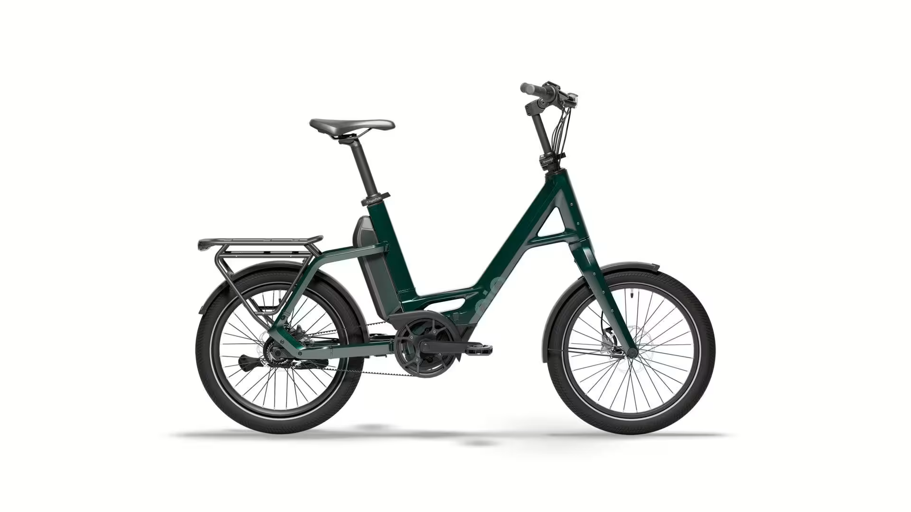

# Přehled modelu P5 - RBN

<!-- HLAVNÍ OBRÁZEK MODELU -->

QiO "Compact P5" je váš chytrý společník do každodenního života – kompaktní, výkonný a stylový. S Boschem uprostřed s chytrým systémem a baterií 545 Wh lze dynamickou podporu až do 25 km/h naplno využívat. Nenáročný řemen a pětistupňová převodovka Shimano "Nexus" zajišťují tichou a plynulou jízdu – ideální pro město i cesty.

20" kola a pevný hliníkový rám nabízejí obratnost a pohodlí. Nízký průchod vám usnadňuje nastupování a vystupování.

Hydraulické kotoučové brzdy, blatníky a povolená celková hmotnost 180 kg dělají z QiO "Compact P5" skutečného hrdinu pro každodenní použití. Všechno se sem vejde – pro vás i váš mobilní životní styl.

## <u><strong>Rychlé informace</strong></u>

- Typ rámu: QIO Compact, Bosch Gen. 4, BES3, hliník, 48 cm 
- Velikosti: One‑Size (doporučeno 150–190 cm) -> 20"
- Barvy: Lead metal glossy; Lunar white matt; Night black matt; Dark olive matt; Petrol blue matt; Imola red glossy; Retro blue matt
- Hlavní komponenty: **Motor**: BOSCH Performance Line / 50Nm; **Baterie**:PowerPack 545; **Brzdy**:Hydraulické kotoučové brzdy Magura MT A2; **Řazení**:Shimano Nexus 5E (pětistupňová nábojová převodovka)
- Zaměření modelu: Kompaktní městské elektrokolo 

## <u><strong>Odkazy na další části</strong></u>

👉 [Montáž](Montáž.md)  
👉 [Kusovníky](Kusovníky.md)