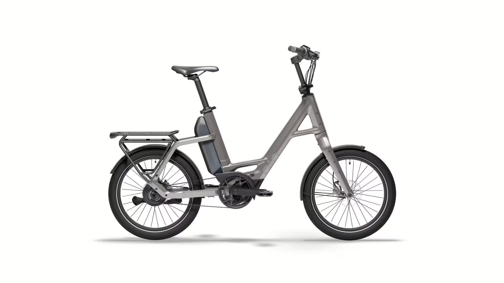

# Přehled modelu Compact PE

<!-- HLAVNÍ OBRÁZEK MODELU -->

 

"Compact PE" od QiO znamená chytrou mobilitu se stylem. Výkonný středový motor Bosch se systémem Smart System a baterií 545 Wh spolehlivě zvládne až 25 km/h – tiše, efektivně a s nízkou údržbou díky řemenovému pohonu. Plynule měnitelný náboj Enviolo TR zajišťuje plynulé řazení.
S 20" koly a pevným hliníkovým rámem je kompaktní kolo obratné a pohodlné. Štědrý průchod usnadňuje nastupování – ideální pro ty, kteří preferují snadnou ovladatelnost. Hydraulické kotoučové brzdy vám poskytují bezpečí za každého počasí.
S povolenou celkovou hmotností 180 kg a praktickými prvky, jako jsou blatníky, je "Compact PE" připraven pro všechny trasy, které chcete použít. S našimi chytrými doplňky lze také snadno doplňovat a přizpůsobovat osobnost.

## <u><strong>Rychlé informace</strong></u>

- Typ rámu: QIO Compact, Bosch Gen. 4, BES3, hliník, 48 cm 
- Velikosti: One‑Size (doporučeno 150–190 cm) -> 20"
- Barvy: Lead metal glossy; Lunar white matt; Night black matt; Dark olive matt; Petrol blue matt; Imola red glossy; Retro blue matt
- Hlavní komponenty: **Motor**: BOSCH Performance Line / 50Nm; **Baterie**:PowerPack 545; **Brzdy**:Hydraulické kotoučové brzdy Magura MT A2; **Řazení**:ENVIOLO "Twist Pure Display", nekonečně proměnný
- Zaměření modelu: Kompaktní městské elektrokolo

## <u><strong>Odkazy na další části</strong></u>

👉 [Montáž](Montáž.md)  
👉 [Kusovníky](Kusovníky.md)