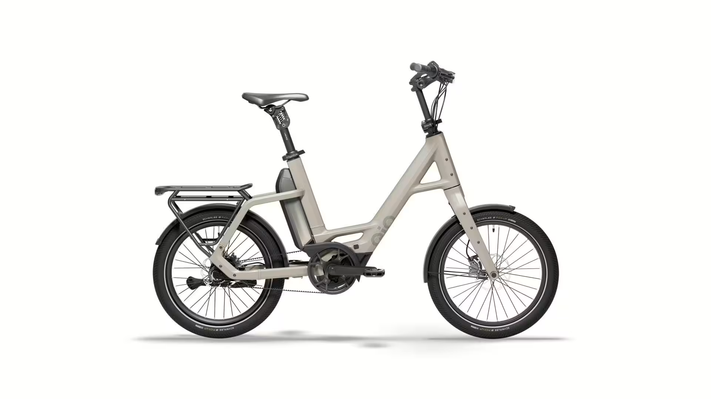

# Přehled modelu PX5+ - LL

<!-- HLAVNÍ OBRÁZEK MODELU -->

Kompaktní, výkonný, stylový – "Compact PX5+" od QiO je vaším chytrým společníkem pro městskou mobilitu. S Bosch středovým motorem a Bosch Smart Systémem si můžete užít spolehlivou podporu až do 25 km/h – tiché, úsporné a nenáročné díky řemenovému pohonu. Baterie 800 Wh vám umožní zvládnout den v klidu, i na delší vzdálenosti.
Pětistupňová převodovka Shimano "Nexus" zajišťuje pohodlné řazení, zatímco hydraulické kotoučové brzdy vám dávají plnou kontrolu po celou dobu. S 20" koly, odpruženou sedlovkou a pevným hliníkovým rámem je kompaktní kolo určeno pro každého – bez ohledu na věk nebo styl jízdy.
"+" znamená maximální hmotnost jezdce 150 kg – ideální pro výkonnější jezdce nebo větší náklad. To vám nejen usnadňuje každodenní život, ale také výrazně zvyšuje flexibilitu – a styl

## <u><strong>Rychlé informace</strong></u>

- Typ rámu: QIO Compact, Bosch Gen. 4, BES3, hliník, 48 cm 
- Velikosti: One‑Size (doporučeno 150–190 cm) -> 20"
- Barvy: Lead metal glossy; Lunar white matt; Night black matt; Dark olive matt; Petrol blue matt; Imola red glossy; Retro blue matt
- Hlavní komponenty: **Motor**: BOSCH Performance Line PX/ 85Nm; **Baterie**:PowerPack 800; **Brzdy**:Hydraulické kotoučové brzdy MAGURA "LOUISE"; **Řazení**:SHIMANO "Nexus SG-C7000-5D", 5stupňová převodovka
- Zaměření modelu: Kompaktní městské elektrokolo 

## <u><strong>Odkazy na další části</strong></u>

👉 [Montáž](Montáž.md)  
👉 [Kusovníky](Kusovníky.md)