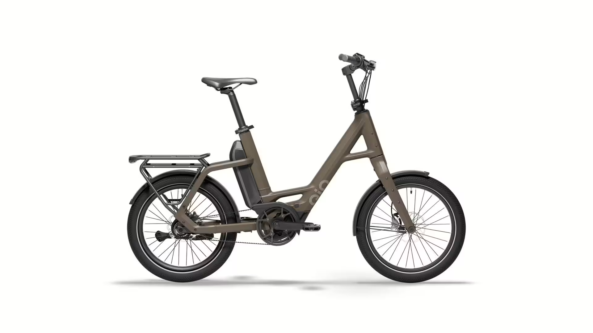

# Přehled modelu P5 - LL

<!-- HLAVNÍ OBRÁZEK MODELU -->

Zatím není potvrzené vybavení / doplňky modelu.

## <u><strong>Rychlé informace</strong></u>

- Typ rámu: QIO Compact, Bosch Gen. 4, BES3, hliník, 48 cm 
- Velikosti: One‑Size (doporučeno 150–190 cm) -> 20"
- Barvy: Lead metal glossy; Lunar white matt; Night black matt; Dark olive matt; Petrol blue matt; Imola red glossy; Retro blue matt
- Hlavní komponenty: **Motor**: ; **Baterie**:; **Brzdy**:; **Řazení**:
- Zaměření modelu: Kompaktní městské elektrokolo 

## <u><strong>Odkazy na další části</strong></u>

👉 [Montáž](Montáž.md)  
👉 [Kusovníky](Kusovníky.md)