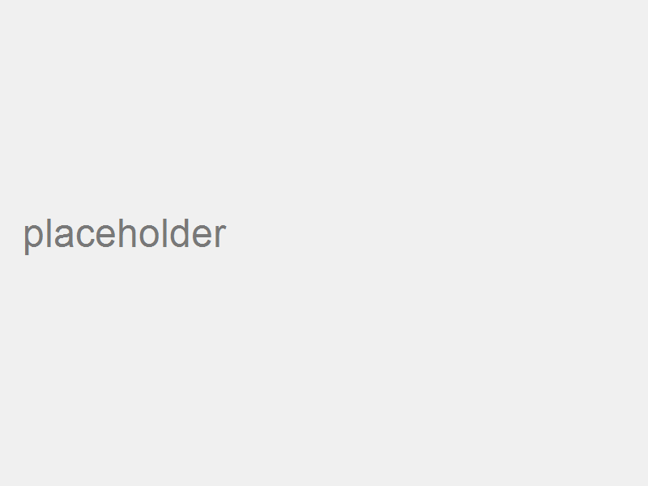

# Modul: {{NÁZEV MODULU}}

  

## Popis

Stručný technický popis modulu.  
Co to je, k čemu slouží, jaká je jeho funkce v rámci kola QiO.

---

## Obrázky – detaily

  
  

  

---

## Technické parametry

| Parametr | Hodnota |
|---------|---------|
| Typ | ... |
| Materiál | ... |
| Kompatibilita | ... |
| Poznámka | ... |

---

## Montážní poznámky

- krok 1  
- krok 2  
- krok 3  

---

## Odkazy na další moduly

👉 [Motor](../motor/motor.md)  
👉 [Baterie](../baterie/baterie.md)  
👉 [Brzdy](../brzdy/brzdy.md)
